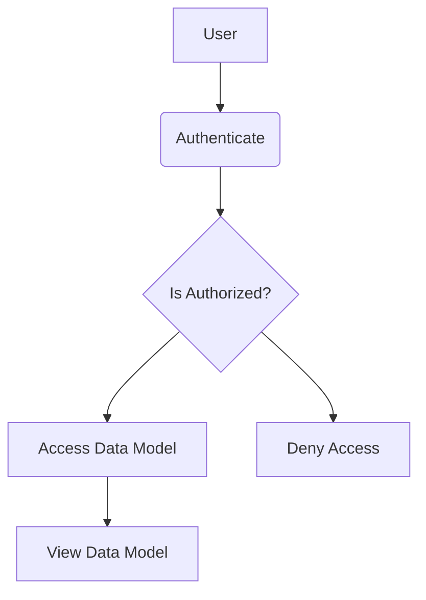

### Data Model
A relational database works well with read-heavy and write less frequency workflow.

```mermaid
graph TD;
    A[User] --> B(Authenticate);
    B --> C{Is Authorized?};
    C --> D[Access Data Model];
    C --> E[Deny Access];
    D --> F[View Data Model];
```

### Concurrency issues

